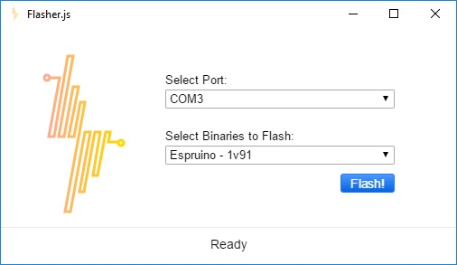

# Getting Started with Flasher.js

Hi! We're thrilled you want to get started with JavaScript running natively on devices! We've tried hard to make this process as easy as possible for you. There are three steps:

1. Download and Install Flasher.js
2. Install Drivers (if required)
3. Flash Your Device

Let's go!

## Step 1: Download and Install Flasher.js

First things first: head over to the [Flasher.js releases page](https://github.com/thingsSDK/flasher.js/releases) and download the latest version. We have lots of options for you - you can run Flasher.js on Linux, Mac, and Windows (both 34bit and 64bit). You can even compile the source yourself if you're feeling brave. 

On Windows, you'll be downloading the binary directly, so you can just move it where you'd like it. On a Mac, you'll be downloading a disk image (.dmg) file. Double-click it and drag it over to your Applications folder. If you're on Linux you'll be downloading a Debian package (.deb). Double-click it to install.

## Step 2: Install Drivers (if required)

Before you open up Flasher.js, you may need to install some drivers for your board. Luckily, we've put together a little table with the related links for you on our [Compatible Devices](./compatible-devices.md) page. Go ahead and go check it out and install the drivers if you need them. We'll be here when you get back!

## Step 3: Flash Your Device

Onto the fun part! Plug in your device, then double-click on your freshly installed Flasher.js binary. You'll see a screen like this (with slight differences for your OS):

Flasher.js will attempt to auto-select the port for you, but you can double check it. On Windows, these are going to look like "COM3", while on Mac and Linux they will be more like "/dev/ttyUSB1" or "/dev/cu.usbmodem150".

Next, pick what runtime you want to flash on your device. We've got multiple versions of [Espruino](https://www.espruino.com/), as well as [Mongoose OS](https://mongoose-iot.com/) (formerly Smart.js), [thingSwitch](https://www.eclipse.org/smarthome/documentation/javadoc/org/eclipse/smarthome/model/thing/thing/util/ThingSwitch.html), and even [MicroPython](https://micropython.org/)! If you're not sure, and you just want to get going on some of the tutorials you've seen elsewhere on thingsSDK, just pick the latest version of Espruino.

And now - the moment you've been waiting for - click the Flash! button. Flasher.js will go download the appropriate binary for you, prepare it, and flash your device - all in one step!

You're all set to start on the rest of the thingsSDK toolchain and build your project.
